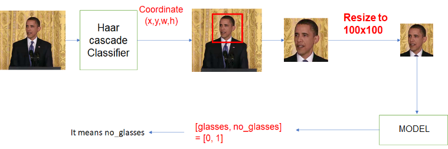
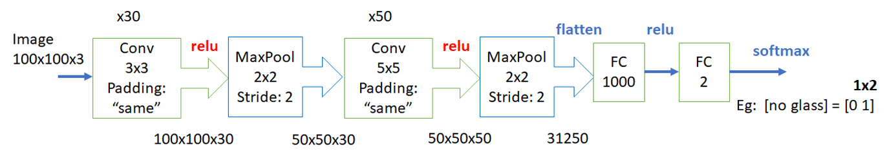
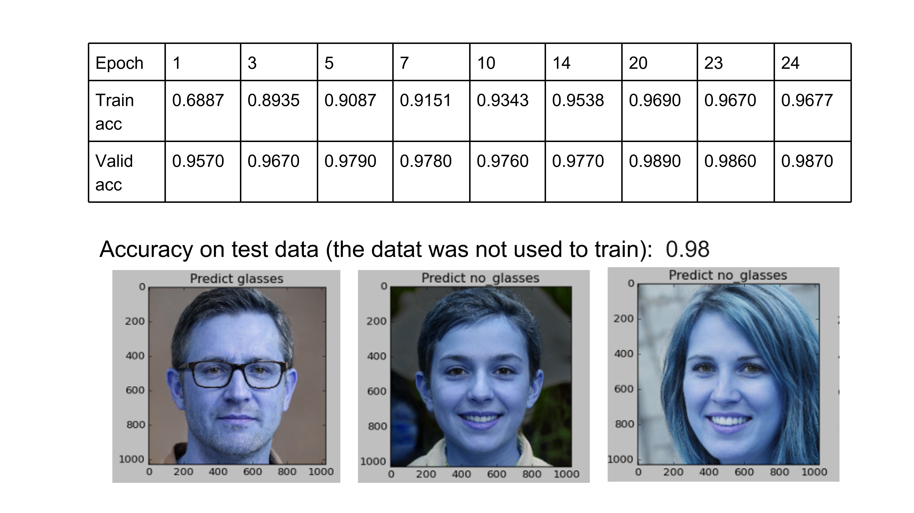

# Glasses Detection using Deep Convolution Neural Network

## Introduction

This is repository for the homework of Artificial Intelligence course. The description of project is here.

## Description

We aim to create an application to detect whether the people in images are wearing glasses or not. Model that we used in this task is LeNet or ResNet50. 

I. <strong>Dataset:</strong>

You can download dataset from [Data Cleaning of Glasses-No Glasses](https://www.kaggle.com/datasets/jorgebuenoperez/datacleaningglassesnoglasses). This dataset is originated from [Glasses or No Glasses](https://www.kaggle.com/datasets/jeffheaton/glasses-or-no-glasses). However, the original dataset is raw so dataset in first link was re-orginized from it by gathering all face with glasses images into a folder named 'glasses' and gethering all face without glasses images into a folder named 'no glasses'. 

This dataset contains 4322 images incluing 2470 images people wearing glasses and 1852 images people waering glasses. Besides, we also collect 300 images of people wearing glasses and 300 images of people no wearing glasses in order to make the dataset more various. The size of images in dataset is 1024x1024.

II. <strong>Deep Learning Model:</strong>

As for detecting face from images, we use the classifier named Haar-cascade. Haar-cascade classifier returns coordinates (x,y) and dimensions (w,h) of area containing faces. Based on this parameters, we separate the images out of original images. Then, the images will be resized to 100x100x3 which is also the input dimension of LeNet.

Below is the structure of model which is designed based on LeNet but we change parameters.

III. <strong>How To Run: </strong>

  1. Firstly, We make sure that our computer installed python as well as required library from this code. 
  2. Secondly, We download the dataset from the link [Glasses or No Glasses Dataset](https://www.kaggle.com/datasets/jorgebuenoperez/datacleaningglassesnoglasses). We extract the dataset folder so that the python files and the folder 'images' are in the same place.
  3. Thirdly, we open cmd in the folder containing python files and type 'python training_model.py' to train model. After training, there are a folder named 'my.model' appears which contains parameters of model.
  4. Fourthly, we type 'python testing_model.py' to test the model by camera laptop (make sure that your laptop has camera).
  
IV. <strong>Result: </strong>
 
The model demonstrated good performance in both training dataset, validation dataset and testing dataset. The results shown below were obtained after training a LeNet-based model for 25 epochs.

